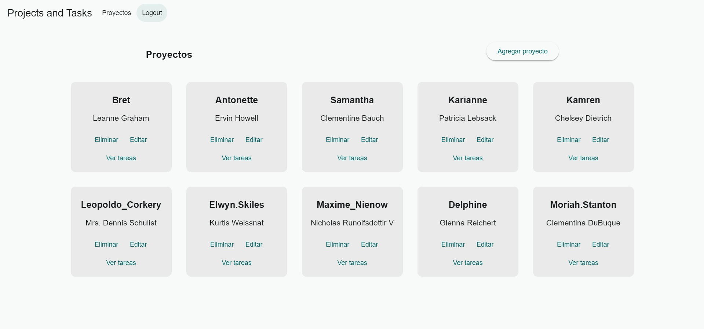

Este proyecto permite gestionar proyectos y tareas utilizando una API externa de ejemplo. Permite visualizar, editar y eliminar tareas y proyectos (aunque las acciones de edición y eliminación son simuladas).

- **Referencia a proyectos**: https://jsonplaceholder.typicode.com/users
- **Referencia a tareas**: https://jsonplaceholder.typicode.com/todos

## 🚀 Netlify

<!-- > [ jd2698-projects-and-tasks.netlify.app/](https://jd2698-projects-and-tasks.netlify.app/) -->
> <a href="https://jd2698-projects-and-tasks.netlify.app/" target="_blank">jd2698-projects-and-tasks.netlify.app/</a>

# Dev

- Instalar dependencias `npm install`
- Ejercutar proyecto `ng serve`

# Estructura de carpetas

- **core**: Contiene servicios y guards generales.
- **features**: Aquí se encuentran los módulos principales del proyecto, como tareas, proyectos y autenticación.
- **shared**: Contiene componentes reutilizables como el modal de confirmación.

# Dependencias

- **Angular Material**: Para componentes UI preconstruidos.

# App

